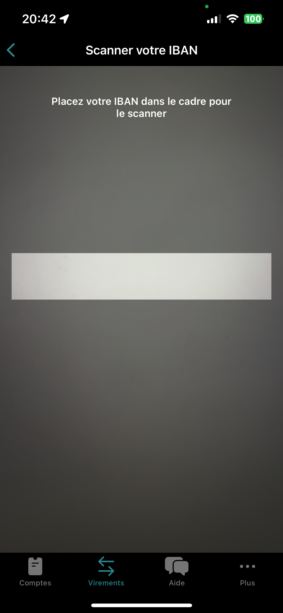

# IBAN Reader App

IBAN Reader App is a SwiftUI application that allows users to scan and recognize IBAN (International Bank Account Number) codes.

## Features

- **IBAN Scanner**: Scan IBAN codes using the device's camera with Vision Kit.
- **IBAN Validation**: Validate IBAN codes using the MOD 97 algorithm.
- **French IBAN Formatting**: Format IBAN codes according to the French IBAN format.

## Screenshots

    
  

## Installation

To install and run the Text Recognition App on your local machine, follow these steps:

1. Clone the repository: `git clone https://github.com/bokri/iban-reader-ios`
2. Open the project in Xcode.
3. Build and run the app on a simulator or a physical device.

## Usage

1. Launch the app on your iOS device.
2. Navigate to the "Virements" tab to access the IBAN scanning feature.
3. Tap the "Scanner" button to open the IBAN scanner.
4. Point your device's camera at an IBAN code to scan it.
5. The scanned IBAN code will be displayed on the screen along with its validation status.
6. You can also manually enter an IBAN code in the provided text field.

## Contributing

Contributions are welcome! If you have any suggestions, feature requests, or bug reports, please open an issue or submit a pull request.

## Technologies Used

- SwiftUI
- Vision Kit

## License

This project is licensed under the MIT License - see the [LICENSE](LICENSE) file for details.